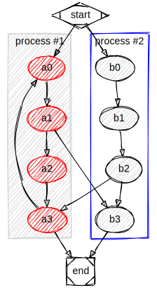

# Sketchviz

This repo is a command line clone of https://sketchviz.com/ (understand: it's a rip-off)

### Main features:

- produce a svg from a dot file
- use the latest version of GraphViz (and not Viz.js). This fixes tons of issues
- watch for file changes and update the svg automatically

### Demo

```
sketchviz examples/clusters.dot examples/clusters.svg
```



If you don't want to install it, you can also `node src/sketch.js`.

### Install:

```bash
$ git clone https://github.com/gpotter2/sketchviz.git
$ cd sketchviz
$ sudo npm install -g
```
